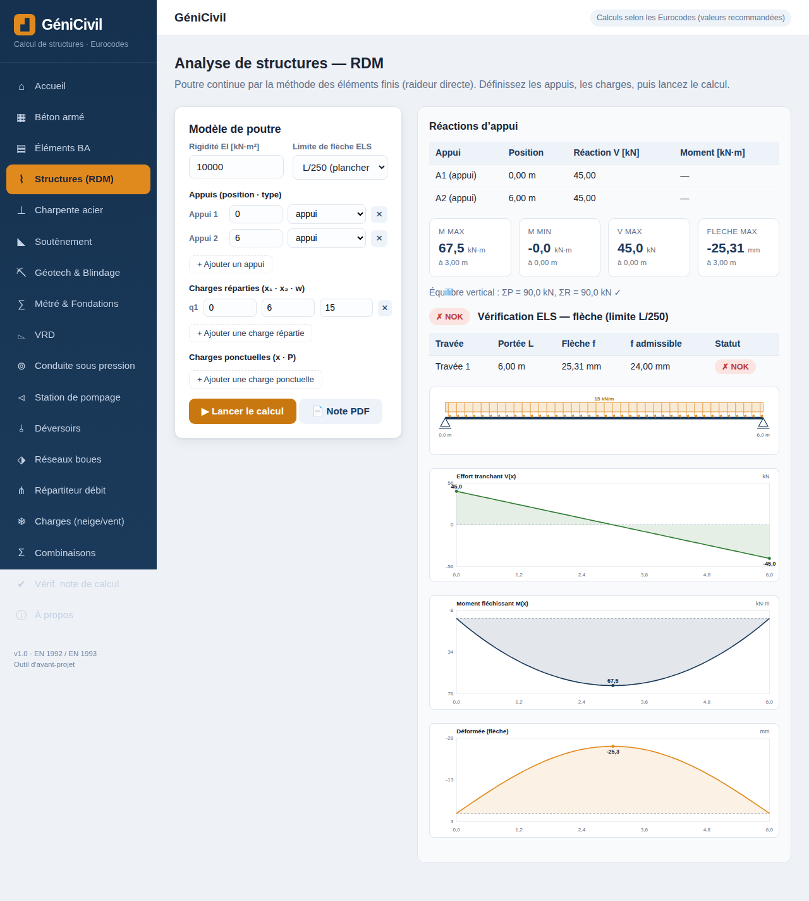

# GéniCivil — Logiciel de calcul de génie civil

Application web complète de calcul de structures conforme aux **Eurocodes**.
Elle fonctionne **entièrement dans le navigateur** : aucune installation, aucun
serveur, aucune donnée transmise. Le moteur de calcul est séparé de l'interface
et **validé par une suite de tests automatisés** comparés à des solutions
analytiques connues.



## Modules

| Module | Norme | Contenu |
|--------|-------|---------|
| **Béton armé** | EN 1992-1-1 | Flexion simple (section simplement/doublement armée), **poutre en Té** (axe neutre table/âme), effort tranchant (treillis de bielles), poteau en flexion composée avec **diagramme d'interaction N-M**, dalle pleine |
| **Analyse de structures (RDM)** | Éléments finis | Poutre continue par la **méthode de la raideur directe** (élément d'Euler-Bernoulli) : réactions, effort tranchant V(x), moment fléchissant M(x), déformée, **vérification ELS de la flèche** par travée (L/250, L/300, L/500) |
| **Charpente acier** | EN 1993-1-1 | Base de profilés **IPE / HEA / HEB**, traction, **flambement par flexion**, flexion, cisaillement, interaction N+M |
| **Métré & Fondations** | Avant-métré / DTU | Quantités béton / coffrage / acier, estimation de coût, **semelle isolée** par la méthode des bielles |
| **Charges climatiques** | EN 1991-1-3 / 1-4 | **Neige** (s = μ₁·Ce·Ct·sk, zones françaises + altitude) et **vent** (pression dynamique de pointe qp(z), pression sur paroi) |
| **Éléments BA** | EN 1992-1-1 | **Dalle portant deux sens** (coefficients μx/μy), **semelle filante**, **voile porteur** (§12.6.5.2) |
| **Soutènement / ouvrages enterrés** | EC2 / EC7 | **Mur en T** : stabilité externe (renversement, glissement, poinçonnement du sol) et **ferraillage** du voile et du talon |
| **Géotechnique & Blindage** | Rankine / Terzaghi-Peck | **Poussée des terres** (nappe, cohésion, surcharge) et **tranchée blindée** : HEB + bois (soldats, planches, butons) ou **caisson** |
| **VRD** | Rationnelle / Manning-Strickler | **Assainissement pluvial** (Q=C·i·A), **canalisations** gravitaires (Ø requis, autocurage), **caniveau** (canal à surface libre), **récupération des eaux pluviales** (bâche), **terrassement** de tranchée, **corps de chaussée** (CBR indicatif) |
| **Combinaisons d'actions** | EN 1990 | Génération automatique des combinaisons **ELU fondamentales** et **ELS** (caractéristique, fréquente, quasi-permanente) avec coefficients ψ |
| **Conduite sous pression** | Darcy-Weisbach | Vitesse, **pertes de charge** (Colebrook-White), diamètre économique, **coup de bélier** (célérité, Joukowsky), tenue de la paroi (contrainte / PN) |
| **Station de pompage** | Hydraulique | **HMT**, puissances (hydraulique / arbre / électrique), **volume utile de bâche** (anti court-cycle), **cavitation** (NPSH), **point de fonctionnement** (intersection courbe pompe × courbe réseau) |
| **Déversoirs** | Surface libre | Seuils **rectangulaire** (Rehbock / Francis), **triangulaire** (V-notch), **épais**, et **déversoir d'orage** (lame déversante, taux de dilution) |
| **Réseaux de boues** | Bilan de masse | Masse volumique selon **siccité**, débit de **matière sèche**, **épaississement** / déshydratation, pertes de charge corrigées de la concentration |
| **Répartiteur de débit** | Orifices noyés | Ouvrage **passif** répartissant un débit sur plusieurs tuyaux : niveau d'équilibre, débit et % par sortie, régulation par paliers |
| **Vérificateur de note de calcul** | Contrôle croisé | **Recalcul indépendant** d'une note (BA flexion, semelle, soutènement, canalisation, **RDM, acier, pompage**), **verdict** conforme / avec réserves / non conforme et **corrections** ; extraction des valeurs depuis un texte collé |

Chaque module permet d'**exporter une note de calcul en PDF** (bouton « Note PDF »,
via l'impression du navigateur) : en-tête, données d'entrée, résultats et avertissement.

## Démarrage

L'application n'a **aucune dépendance** pour fonctionner. Deux possibilités :

1. **Ouvrir directement** le fichier `index.html` dans un navigateur.
2. **Servir** le dossier (recommandé) :

   ```bash
   python3 -m http.server 8080
   # puis ouvrir http://localhost:8080
   ```

## Tests

Le moteur de calcul est testable hors navigateur, sous Node.js :

```bash
npm test            # 96 vérifications contre des résultats analytiques
npm run test:browser  # rendu réel dans Chromium (Playwright) + captures
```

Exemples de cas vérifiés :

- Poutre 300×500, fck25, MEd=200 kN·m → **As ≈ 1150 mm²**, z = 400 mm
- Poutre en Té (axe neutre dans l'âme), MEd=400 kN·m → **As ≈ 2330 mm²**
- Poutre sur 2 appuis, L=6 m, w=10 kN/m → R=30 kN, **Mmax = 45 kN·m**, flèche = 16,9 mm
- Poutre continue 2×5 m → réaction centrale **62,5 kN**, moment sur appui −31,25 kN·m
- IPE 200 S235, Lcr=3 m → λ̄=1,43, χ=0,37, **Nb,Rd ≈ 247 kN**
- Semelle NEd=900 kN, σsol=200 kPa → **1,85 × 1,85 m**, As = 9,38 cm²/direction
- Neige zone C1 à 300 m, toiture 15° → **s = 0,60 kN/m²**
- Vent région 3, terrain II, z=10 m → **qp ≈ 0,99 kN/m²**, ce = 2,35
- Poussée active H=5 m, φ=30°, q=10 → Ka=0,33, **Psol=75 kN/ml**
- Mur en T (Hs=4,5 ; B=3 m) → FS renversement **2,68**, σmax 144 kPa
- Tranchée blindée H=4 m → pression apparente 15,6 kPa, **buton 75,7 kN**
- Dalle 2 sens 4×5 m, p=10 → **Mx=8,98**, My=5,35 kN·m/m
- Pluvial C=0,8, i=60 mm/h, A=2 ha → **Q=267 L/s** ; Manning DN300 I=0,5% → 71 L/s
- Combinaisons G=100, Q=50, S=20 → **ELU=232,5**, ELS car.=165
- Conduite DN200 PEHD, Q=50 L/s → V=1,59 m/s, **célérité 264 m/s**, surge 42,8 m
- Pompage Q=100 m³/h, HMT=20 m → **Pélec ≈ 8,65 kW**, bâche 2,5 m³, NPSHd 7,59 m
- Point de fonctionnement pompe×réseau → **Qop=108 m³/h**, Hop=19,3 m
- Vérificateur : note avec As=900 mm² (requis 1150) → **avis NON CONFORME**
- Déversoir rectangulaire b=2 m, H=0,3 m → **Q=0,60 m³/s** ; V-notch 90°, H=0,2 → 24,5 L/s
- Boue à 4 % → **ρ=1013 kg/m³** ; épaississement 1 %→4 % : volume ÷4
- Caniveau 0,3×0,2 m, I=1 % → **Q=81,6 L/s**, V=1,36 m/s
- Récup. EP : toiture 100 m², 700 mm/an → **cuve 4 m³**, couverture 78 %

## Architecture

```
index.html              page unique (SPA)
css/styles.css          mise en forme
js/engine/              MOTEUR DE CALCUL (pur, testable sous Node)
  core.js               facteurs partiels, matériaux, utilitaires
  concrete.js           béton armé EC2 (dont poutre en Té)
  beam.js               solveur RDM (éléments finis)
  steel.js              acier EC3
  profiles.js           catalogue de profilés
  quantities.js         métré & fondations
  loads.js              charges climatiques neige/vent (EN 1991)
  geotech.js            poussée des terres (Rankine)
  trench.js             tranchée blindée (HEB+bois, caisson)
  retaining.js          mur de soutènement en T
  elements.js           dalle 2 sens, semelle filante, voile
  vrd.js                assainissement, canalisations, terrassement
  combos.js             combinaisons ELU/ELS (EN 1990)
  pressure.js           conduite sous pression (Darcy, coup de bélier)
  pumping.js            station de pompage (HMT, NPSH, point de fonctionnement)
  weirs.js              déversoirs (surface libre)
  sludge.js             réseaux de boues (siccité, matière sèche)
  distribution.js       répartiteur passif de débit
  channel.js            caniveau (canal à surface libre, Manning)
  rainwater.js          récupération des eaux pluviales (bâche)
  validator.js          vérificateur de note de calcul
js/ui/                  INTERFACE (navigateur)
  dom.js, plot.js       utilitaires + graphiques SVG
  report.js             génération de la note de calcul PDF
  *.ui.js               contrôleurs par module
  app.js                navigation
tests/                  run-tests.js (Node) + browser-check.js (Playwright)
```

Les modules du moteur sont écrits en **UMD** : ils s'exécutent indifféremment
dans le navigateur (`window.GC.*`) et sous Node.js (`require`), ce qui permet de
les tester sans dépendance.

## Hypothèses de calcul

- État limite ultime (ELU), facteurs partiels recommandés :
  γ<sub>C</sub> = 1,5 ; γ<sub>S</sub> = 1,15 ; γ<sub>M0</sub> = γ<sub>M1</sub> = 1,0 ; α<sub>cc</sub> = 1,0.
- Béton : `fcd`, `fctm`, `Ecm` dérivés de `fck` (EN 1992-1-1 §3.1).
- Acier de construction : E = 210 000 MPa, courbes de flambement a0…d.

## ⚠ Avertissement

Outil d'**aide à l'avant-projet à but pédagogique**. Les résultats doivent être
vérifiés par un ingénieur qualifié et ne remplacent pas une note de calcul
réglementaire (combinaisons d'actions, dispositions constructives, vérifications
à l'ELS, etc.).

## Licence

MIT.
